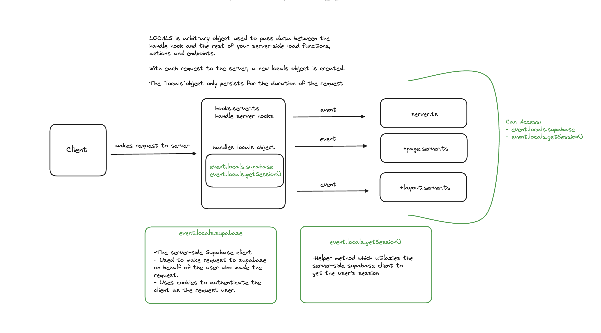
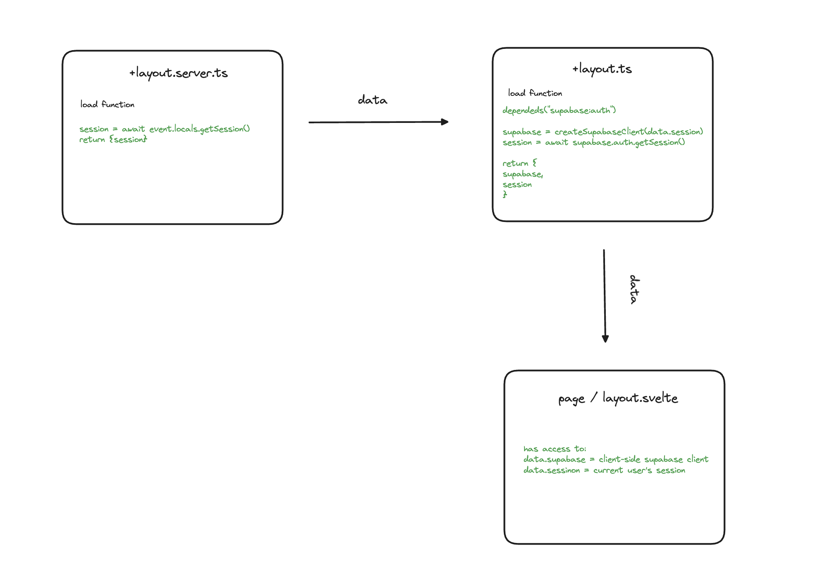

## Suppabase locally via docker

### start project locally

1. Bash command for setting up docker container

```bash
pnpm install supabase -D
pnpx supabase init <init project>
pnpx supabase start <start project>
pnpx supabase status -o env <get env in console>
```

- in supabase/config.toml update site_url and additiona_redirect_urls to the local one

2. Bash command for writing tables and migrations

```bash
pnpx supabase migration new <name> [creante new sql file]
pnpx supabase db reset <runns migrations>
```

## Supabase Postgres and Auth

### Postgres RLS(Row Level Security)

- Even if our code is shit it will prevent from updating in database!
- Client can talk directly to the database, but the database will only return the data that the client is allowed to see.
- You can just think of them as adding a WHERE clause to every query.
- If we activate RLS it will by the default prevent all access to the table, then we can add policies to allow access to the table, write and etc.

1. Add security

```postgresql
alter table public.profiles enable row level security;
```

```postgresql
create policy "Individuals can view their own todos."
    on todos for select
    using ( auth.uid() = user_id );
```

- would translate to this whenever a user tries to select from the todos table:

```postgresql
select *
from todos
where auth.uid() = todos.user_id; -- Policy is implicitly added.
```

#### Helper Functions

- Supabase provides you with a few easy functions that you can use with your policies.

```ts
auth.uid(); // returns the ID of the user making the request
```

- example

```postgresql
-- 1. Create table
create table profiles (
  id uuid references auth.users,
  avatar_url text
);

-- 2. Enable RLS
alter table profiles
  enable row level security;

-- 3. Create Policy
create policy "Public profiles are viewable by everyone."
  on profiles for select using (
    true
  );
-- 4. Create Policy
create policy "Users can update their own profiles."
  on profiles for update using (
    auth.uid() = id
  );
```

- For more about Row Level Security visit [here](https://supabase.com/docs/guides/auth/row-level-security)

### Managing User Data

- everything how to manage userdata on login is here.
- For more about Managing User Data [here](https://supabase.com/docs/guides/auth/managing-user-data)

#### Accessing User Metadata

## SvelteKit Files and Foldres explanation

- Diagram how does local objects works in sveltekit
  

### hooks.server.ts

- For more about hooks [here](https://kit.svelte.dev/docs/hooks)
- to understand better check the diagram above, but in short hooks.server.ts is used to create local object for every request and we have everything we passed on the locals object

## Supabase Auth with SvelteKit

- [here](https://supabase.com/docs/guides/auth/auth-helpers/sveltekit)

### Client Side Supabase

- we are passing session from layout.server to layout so we have access from that in +layout.ts
  

## Stripe

- [here](https://stripe.com/docs/api)

- Login to Stripe via the CLI

```bash
stripe login
```

- foward webhooks to localhost and it gives u stripe signing secret

```bash
stripe listen --forward-to localhost:5173/api/stripe/webhooks
```

- instal stripe-event-types and add to tscofing and add webhook endpoint
- https://github.com/kgajera/stripe-event-types
- it makes it easier to work with stripe events

- creating a test product via stripe cli
- we can create product trough stripe cli (check webook create/update/delete to see how it works), after that product should be in db
- PS server and webhook should be running

```bash
stripe products create --name="Nikies" --description="fast ones" --active="true" --type="service"
```

- deleting a product

```bash
stripe products delete <product_id>
```

- How product and prices works in stripe [here](https://stripe.com/docs/products-prices/how-products-and-prices-work)

### Stripe CLI (on stripe webpage)

- to get products in stripe cli

```bash
stripe prices list
```

- how to setup lookup-key

```bash
stripe prices update price_1NNbOaLiMuQR7qF6TBab877W --lookup-key pro_yearly
```

### Stripe Test clooks

- more about test clooks (trial periods)
- useful to test subscription and etc
- how to cancel after trial period
  [here](https://stripe.com/docs/billing/testing/test-clocks)

### Prevent multiple trials

- we do it with checking if user had subscription before in db


## Github Actions AND CI/CD Pipeline

### supabase 

- add supabase project and login with pnpx supabase login
- after login export supabase password and ref trough terminal

```bash
 export SUPABASE_DB_PASSWORD=<YOUR_DB_PASSWORD>
pnpx supabase link --project-ref <YOUR_PROJECT_REF>

// this is project ref
PUBLIC_SUPABASE_URL="https://<thiskgjfgqdjoleei>.supabase.co"


pnpx supabase db push

```